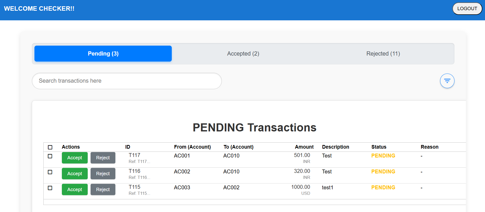
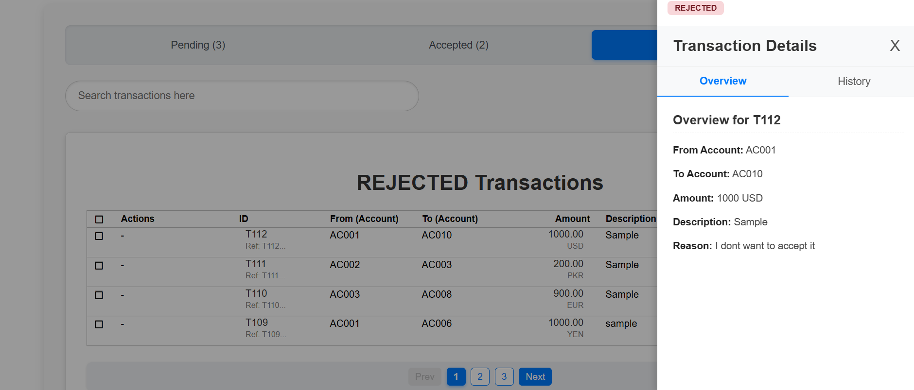
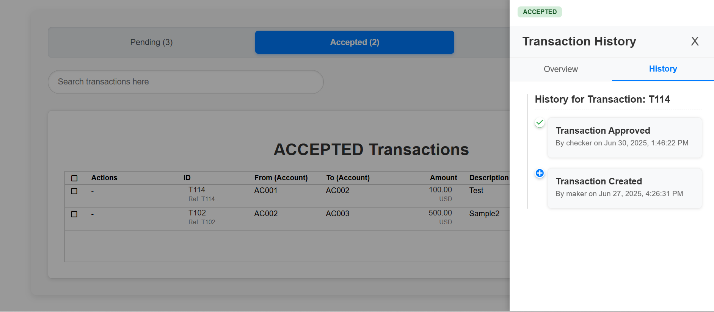

# Transaction Management System

A basic web application for managing financial transactions with role-based (maker-checker pattern) access control.

---

## Features

### User Roles
- **Maker**: Can create, edit, and delete transactions.
- **Checker**: Can accept or reject transactions.

### Functions support for
- Full support for: Create, Edit, Accept, Reject, Delete.

### Interactive Grid (AG-Grid)
- Dynamic data display with:
  - Sorting
  - Pagination
  - Custom cell rendering

### Filtering
- Global search functionality
- Status tabs: All, Accepted, Pending, Rejected
- Sidebar filters:
  - Transaction reference
  - Account selection
  - Date range

### Mass Actions
- Multi-row selection:
  - **Maker**: Bulk delete
  - **Checker**: Bulk accept or reject

---

## Screenshots
<p align="center">
  
</p>

<p align="center">
  
</p>

<p align="center">
  
</p>

---

## Setup & Run

```bash
# Clone the repository
git clone <your-repo-url>

# Install dependencies
npm install

# Start the backend server
node server.js  # or your backend start command

# Start the frontend (Angular)
ng serve

# Open in browser
http://localhost:4200/
