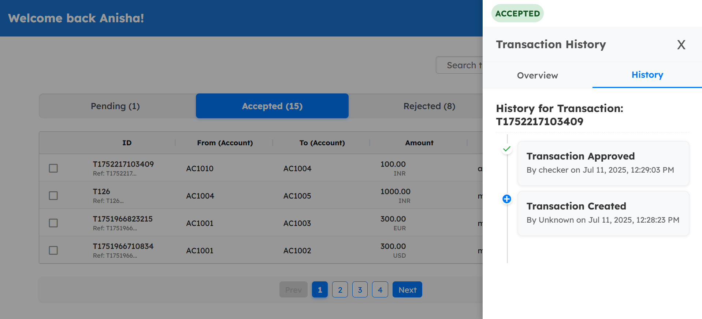
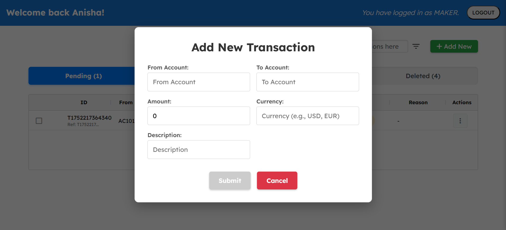

# Transaction Management System

A basic web application for managing financial transactions with role-based (maker-checker pattern) access control, powered by Angular, Node.js/Express, and MongoDB.

More Info : [Link](https://patch-jumbo-4d5.notion.site/MAKER-CHECKER-223de2fe6cfa80caad42f008edb88d23)

## Features

### User Roles

| Role | Permissions |
|------|-------------|
| Maker | Can create, edit, and soft-delete transactions. |
| Checker | Can accept or reject transactions. |
| Admin | Possesses all permissions of both Maker and Checker roles (create, edit, soft-delete, accept, reject). |

### Functions Support

- Full lifecycle support for transactions: Create, Edit, Accept, Reject, Soft-Delete.
- Interactive Grid (AG-Grid)
  - Dynamic data display with:
    - Sorting
    - Pagination
    - Custom cell rendering
    - Real-time updates

### Filtering & Search

- Global search functionality across multiple fields.
- Status tabs: PENDING, ACCEPTED, REJECTED, DELETED.
- Advanced sidebar filters:
  - Transaction reference number
  - From/To Account selection
  - Date range (e.g., custom, this week, last month)

### Mass Actions

- Multi-row selection for bulk operations:
  - Maker: Bulk soft-delete.
  - Checker/Admin: Bulk accept or reject.

## Screenshots

| Login Page | Checker Dashboard with Pending Transactions |
|------------|------------------------------------------|
|  |  |

| Checker Dashboard with Accepted Transactions | Checker Dashboard with Rejected Transactions |
|--------------------------------------|---------------------------|
|  |  |

| Checker Dashboard with Deleted Transactions | Transaction History Timeline |
|----------------------------------|-----------------------------|
|  |  |

| Transaction Creation form | Transaction Overview in Sidebar |
|----------------------------------|-----------------------------|
|  |  |


## Technologies Used

| Component | Technology |
|-----------|------------|
| Frontend | Angular (with TypeScript) |
| UI Components | AG-Grid, PrimeNG (for enhanced UI elements like Timeline, Cards) |
| Backend | Node.js with Express.js |
| Database | MongoDB Atlas |

## Setup & Run

1. **Clone the repository**
    ```sh
    git clone https://github.com/hahaanisha/maker-checker
    cd maker-checker
    ```

2. **Install Node.js dependencies for both frontend and backend**
    ```sh
    # Ensure you are in the root directory where package.json is located
    npm install
    ```

3. **Configure MongoDB Connection (Backend)**
    - Open `server.js` and ensure the MONGODB_URI is correctly set to your MongoDB Atlas connection string.
    - Example:
      ```javascript
      const MONGODB_URI = 'mongodb+srv://<username>:<password>@cluster0.hp6v7gu.mongodb.net/?retryWrites=true&w=majority&appName=Cluster0';
      ```

4. **Start the Backend Server**
    - Open a new terminal window/tab in the project root
    ```sh
    node server.js
    ```

5. **Start the Frontend (Angular) Development Server**
    - Open another new terminal window/tab in the project root
    ```sh
    ng serve --open
    ```
    - The application should automatically open in your browser at [http://localhost:4200/](http://localhost:4200/)

## Default Credentials

For testing purposes, the following default users are created automatically on the first run of the backend:

| email | pwd | role |
|------|----------|----------|
| anisha2@gmail.com | anisha | Admin |
| anisha1@gmail.com | anisha | Maker |
| anisha@gmail.com | anisha  | Checker |
